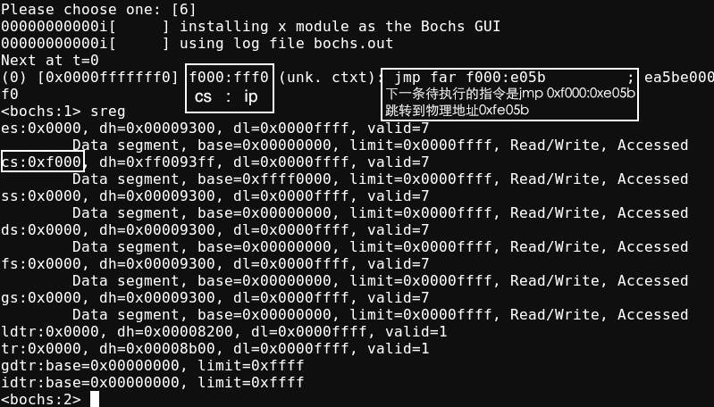

## 第2章 编写MBR住引导记录，让我们开始掌权

* `Fri Jun  4 18:08:01 CST 2021`
* `Sun May 23 14:50:47 CST 2021`

### 2.2 软件接力第一棒, BIOS

**2.2.2 BIOS 是如何苏醒的**

* CPU的 `CS:IP` 寄存器被强制初始化为 `OxF000: 0xFFF0`

**2.2.3 为什么是0x7c00**

* BIOS 最后一项工作校验启动盘中位于 0 盘0道1扇区的内容
* CHS 方式中扇区的编号是从1开始的, LBA 方式中，扇区的编号是从0开始的
* 如果此扇区末尾的两个字节分别是魔数 `0x55` 和 `0xaa`，BIOS便认为此扇区中确实存在可执行的程序, 便加载到物理地址 `0x7c00`
* BIOS跳转到0x7c00是用 `jmp 0:0x7c00`实现的 (更多参考: `x86汇编语言 - 从实模式到保护模式/5.9.2`)

### 2.3 让MBR先飞一会

**2.3.1 神奇好用的\$和\$\$，令人迷惑的 section**

* `$` 当前行的地址
* `$$` 当前 section 的起始地址

**2.3.3 请下一位选手MBR同学准备**

* 默认情况下，所有个人计算机上的显卡在加电之后都将字节置为 80*25这种显示模式
* 80\*25是指一屏可以现实25行，每行80列的字符，也就是2000个字符
* 一个字符要用两个字节来表示，低字符是字符的ASCII编码，高字节是字符属性，故显示一屏字符需要4000字节，这一屏称为一页，0页是默认页

### 参考资料

* [INT 10H](https://zh.wikipedia.org/wiki/INT_10H)
* [为什么主引导记录的内存地址是0x7C00？](http://www.ruanyifeng.com/blog/2015/09/0x7c00.html)