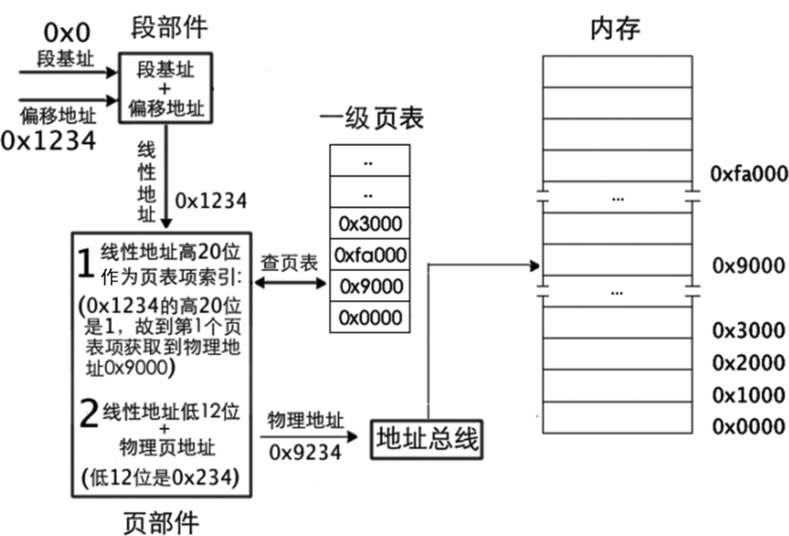
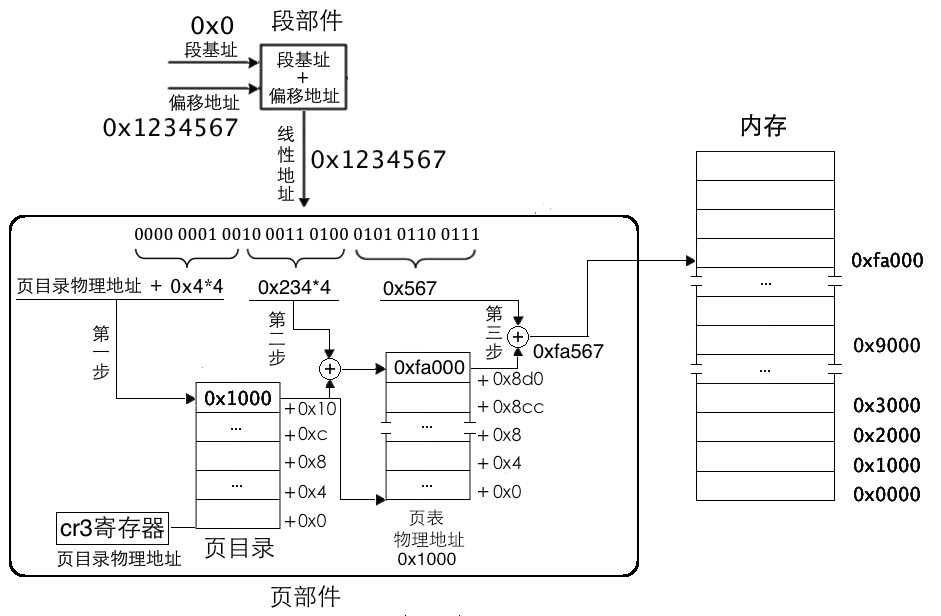
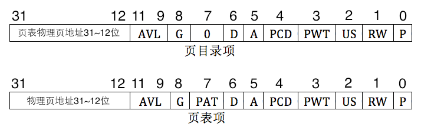

## 5.2 启用内存分页机制，畅游虚拟空间


### 5.2.2 一级页表

* 页表（Page Table）
* 页表中的每一行（只有一个单元格）称为页表项（Page Table Entry， PTE），其大小是 4 字节，页表项的作用是存储内存物理地址
* 任意进制的数字都可以分成高位部分和低位部分，若将低位部分理解为单位大小，高位部分则是这种 单位的数量
* 32 位地址表示 4GB 空间，可以将 32 位地址分成高低两部分，低地址部分是内存块大小，高地址部分是 内存块数量，它们是这样一种关系：内存块数\*内存块大小=4GB
* 页是地址空间的计量单位，并不是专属物理地址或线性地址，只要是 4KB 的地址空间都可以称为一 页，所以线性地址的一页也要对应物理地址的一页
* 右边第 11～0 位用来表示页的大小，也就是这 12 位可以作为页内寻址。左边第 31～12 位用来表示页的数量，同样这 20 位也用来索引一个页




### 5.2.3 二级页表

* 一级页表是将这 1M 个标准页放置到一张页表中
* 二级页表是将这 1M 个标准页平均放置 1K 个 页表中
* 每个页表的物 理地址在页目录表中都以页目录项（Page Directory Entry， PDE）的形式存储
* 二级页表地址转换原理是将 32 位虚拟地址拆分成高 10 位、中间 10 位、低 12 位三部分
* 高 10 位作为页表的索引
* 中间 10 位作为物理页的索引
* 低 12 位作为页内偏移量用于在已经定位到的物理页内寻址



* 标准页大小是 4KB，故地址都是 4K 的倍数，也就是地址的低 12 位是 0，所以只需要记录物理地址高 20 位就可以啦



**启用分页机制，我们要按顺序做好三件事。**

* 准备好页目录表及页表。
* 将页表地址写入控制寄存器 cr3。
* 寄存器 cr0 的 PG 位置 1。

### 5.2.4 规划页表之操作系统与用户进程的关系

* 虚拟地址空间的 0～3GB 是用户进程，3GB～4GB 是操作系统

### 5.2.5 启用分页机制

* 页目录表的位置，我们就放在物理地址 0x100000 处


## 5.3 加载内核

### 5.3.1 用 C 语言写内核

```
gcc -c -o kernel/main.o kernel/main.c
```

* -c 的作用是编译、汇编到目标代码，不进行链接，也就是直接生成目标文件
* -o 的作用是将输出的文件以指定文件名来存储，有同名文件存在时直接覆盖

```
ld kernel/main.o -Ttext 0xc0001500 -e main -o kernel/kernel.bin
```

* -Ttext 指定起始虚拟地址为 0xc0001500
* -e 和--entry 一样，字面上的意思是用来指定程序的起始地址
