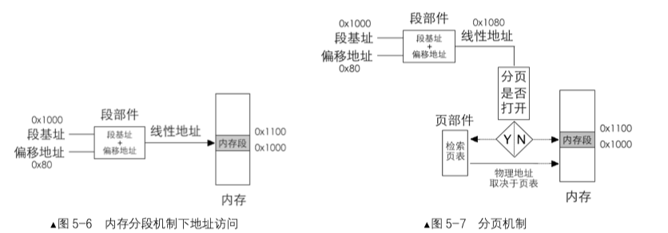
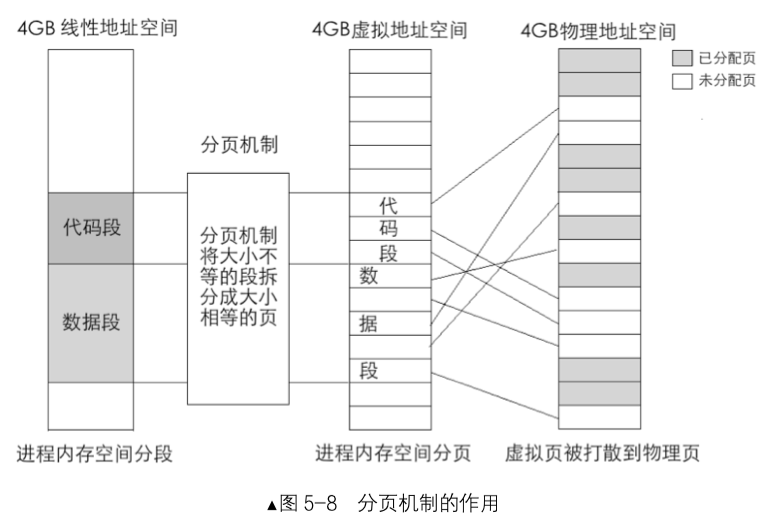
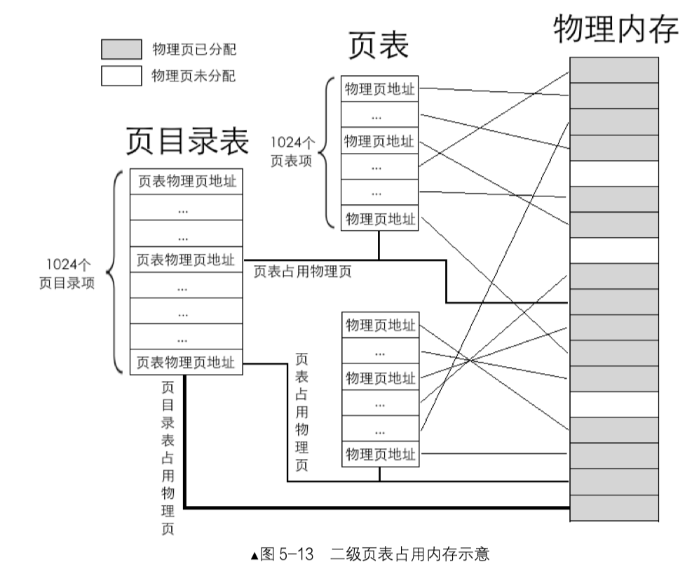
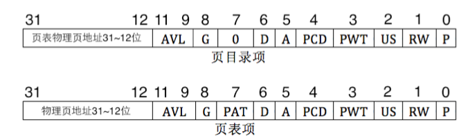

## 第5章 保护模式进阶，向内核迈进

**5.2.2 一级页表**



* 分页机制的思想是： 通过映射，可以使连续的线性地址与任意物理内存地址关联



* 我们需要找一个地方来存储这种映射关系，这个地方就是页表
* 页表就是个N行1列的表格，页表中的每一行称为页表项，其大小是4字节，页表项的作用是存储内存物理地址
* 分页机制本质上就是将大小不同的大内存段拆分成大小相等的小内存块


* 页是地址空间计量单位，只要是4KB的地址空间都可以称为一页
* 分页机制打开前要将页表地址加载到控制寄存器 cr3 中

**5.2.3 二级页表**

> 二级页表地址转换原理是将 32 位虚拟地址拆分成高 10 位、中间 10 位、低 12 位三部分，它们 的作用是：高 10 位作为页表的索引，用于在页目录表中定位一个页目录项 PDE，页目录项中有页表物理地址， 也就是定位到了某个页表。中间 10 位作为物理页的索引，用于在页表内定位到某个页表项 PTE，页表项中有分 配的物理页地址，也就是定位到了某个物理页。低 12 位作为页内偏移量用于在已经定位到的物理页内寻址



**启用分页机制 **

* 准备好页目录表及页表。
* 将页表地址写入控制寄存器 cr3
* 寄存器 cr0 的 PG 位置 1

* 不要一次性地将全部页表项建好，需要时动态创建页表项
*  无论是几级页表，标注页的尺寸都是4KB
*  cr3 寄存器又称为页目录基址寄存器(Page Directory Base Register, PDBR)
*  启动分页机制的开关是将控制寄存器CR0 的 PG位置1（第31位)




**5.2.4 规划页表之操作系统与用户进程的关系**

* 0~3GB是用户进程，3GB～4GB是操作系统
*  让所有用 户进程 3GB～4GB 的虚拟地址空间都指向同一个操作系统


**5.2.5 启用分页机制**

### 5.3  加载内核

**ld**

* `-Ttext` 指定起始虚拟地址
* `-e` 用来指定程序的起始地址 
*  默认只把名为`_start`的函数作为程序的入口地址

* [Ubuntu16.04_x64的gcc 编译32位 elf 文件](https://blog.csdn.net/jiaruitao777/article/details/103419356)


**5.3.2 二进制程序的运行方法**

* 有没有一种灵活的方式让程序的加载地址不那么固定呢o
* 程序头用来描述程序的布局信息，它属于信息的信息，也就是元数据


**5.3.3 elf 格式的二进制文件**

* 在ELF规范中，把符合ELF格式协议的文件统为目标文件
* 程序中最重要的部分就是段(segment)和节(section)，他们是真正的程序体
* 段和节的信息也是用header来描述的，程序头是program header 节头是 section header
* ELF格式的作用体现在两个方面，一是链接阶段，另一方面是运行阶段
* `/usr/include/elf.h`
* `ELF header` -> `Elf32_Ehdr`
* `Elf32_Phdr`
* `readelf -e`


```c
// gcc -c -o
// -c 编译、汇编到目标代码
// -o 文件名


// file main.o(relocatable)
// nm main.o
//
// ld main.o -Ttext 0xc0001500 -e main -o
// -Ttext 指定开始虚拟地址
// -e --entry 指定程序的起始地址
```
